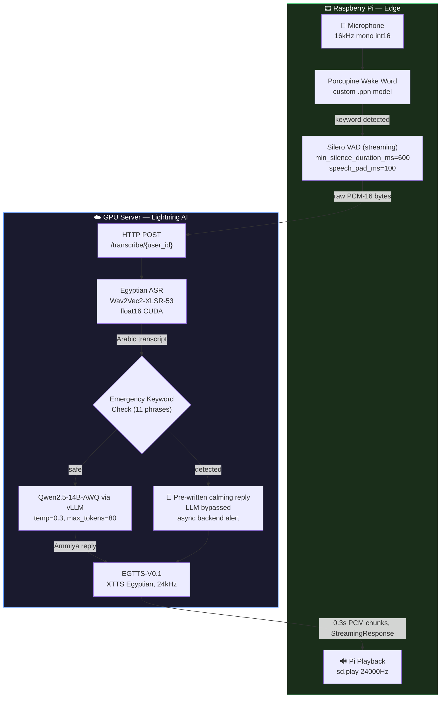

<div align="center">

# 🎙️ ونيس — Wanees
### *An Egyptian-Arabic AI Voice Companion for the Elderly*

> **An open-source Egyptian Arabic voice companion — edge wake-word detection on Raspberry Pi, cloud inference (ASR → LLM → TTS) on a GPU server, built to speak the way a caring son or grandson would.**

<br>

[](LICENSE)
[](https://www.python.org/)
[](server/main.py)
[](https://lightning.ai/)
[](https://github.com/vllm-project/vllm)
[](https://huggingface.co/Qwen/Qwen2.5-14B-Instruct-AWQ)
[](https://huggingface.co/OmarSamir/EGTTS-V0.1)
[](https://www.raspberrypi.com/)

<br>

</div>

---

## 📋 Table of Contents

- [The Social Imperative](#-the-social-imperative)
- [Key Features](#-key-features)
- [System Architecture](#-system-architecture)
- [Latency Budget](#-latency-budget)
- [Model Stack](#-model-stack)
- [Wanees Persona & Prompt Design](#-wanees-persona--prompt-design)
- [Emergency Detection System](#-emergency-detection-system)
- [HTTP API Reference](#-http-api-reference)
- [Server Setup (Lightning AI)](#-server-setup-lightning-ai)
- [Raspberry Pi Client Setup](#-raspberry-pi-client-setup)
- [Wake Word Training (Porcupine)](#-wake-word-training-porcupine)
- [Project Structure](#-project-structure)
- [Roadmap](#-roadmap)
- [Contributing](#-contributing)
- [License](#-license)

---

## 🌍 The Social Imperative

The Arab world is aging fast — the elderly population across MENA is projected to grow substantially over the coming decades — yet assistive voice technology for Arabic speakers remains underdeveloped. Mainstream assistants (Alexa, Siri, Google Assistant) fall short for this population on several fronts: they don't speak Egyptian Ammiya, they're built around app-driven UX rather than voice-first interaction, and they have no concept of "the person on the other end may need comfort, not just an answer."

**Wanees (ونيس)** — meaning *companion*, *the one who brings comfort* — is built to close that gap: a warm, dialect-fluent, familial voice that also knows when to stop being a chatbot and raise an alarm.

| Challenge | Typical Voice Assistants | Wanees |
|---|---|---|
| **Arabic dialect** | Modern Standard Arabic only | Egyptian Ammiya (Cairo/Delta) |
| **Persona** | Generic, corporate | "الابن البار" — a dutiful son / warm grandson |
| **Emergency response** | None | Keyword detection → immediate calming reply + async caregiver alert |
| **Medication reminders** | None | Backend-pushed, queued per device, delivered as spoken audio |
| **Compute split** | Varies | Heavy models on GPU server; Pi only handles wake word, VAD, and playback |

---

## ✨ Key Features

- 🗣️ **Egyptian Ammiya ASR** — `IbrahimAmin/egyptian-arabic-wav2vec2-xlsr-53` via a HuggingFace `pipeline`, float16 on CUDA
- 🧠 **Egyptian-persona LLM** — `Qwen/Qwen2.5-14B-Instruct-AWQ`, served through [vLLM](https://github.com/vllm-project/vllm)'s OpenAI-compatible API, constrained to a warm, dialect-only, sub-140-character persona
- 🔊 **Egyptian TTS** — `OmarSamir/EGTTS-V0.1` (an XTTS variant fine-tuned on Egyptian speech), synthesized once per reply and streamed back in 0.3s PCM chunks at 24kHz
- 👂 **Wake word on the edge** — [Porcupine](https://picovoice.ai/platform/porcupine/) with a custom-trained `.ppn` keyword model, running entirely on the Pi CPU
- 🎯 **Streaming VAD endpointing** — [Silero VAD](https://github.com/snakers4/silero-vad)'s `VADIterator` detects the end of speech in real time (600ms silence threshold) instead of relying on a fixed recording window
- 🚨 **Emergency keyword detection** — 11 Egyptian Ammiya distress phrases bypass the LLM entirely and fire a non-blocking alert to a caregiver backend
- 💊 **Medication reminders** — a caregiver backend pushes text to a per-user queue; the Pi polls for pending reminders and fetches synthesized audio on demand
- 🔁 **Rolling per-device conversation history** — last 6 turns kept in memory, last 2 injected into each LLM call to keep prompts short and latency low
- ⚡ **Streaming audio delivery** — the server responds to `/transcribe/{user_id}` with a chunked `StreamingResponse`, so the Pi can start playback before the full reply has finished streaming down

---

## 🏗️ System Architecture

### Two-component design

```
server/main.py    ←  GPU host (Lightning AI Studio)   — FastAPI: ASR + LLM + TTS + reminder queue
client/pi_client.py  ←  Raspberry Pi (edge)             — Porcupine wake word + Silero VAD + playback
```

### Full pipeline

```
┌──────────────────────────────────────────────────────────────────────┐
│                     RASPBERRY PI (Edge)                              │
│                                                                       │
│  🎤 Microphone  (16kHz, mono, int16)                                  │
│        │                                                              │
│        ▼  frame_length = Porcupine.frame_length (~512 samples)        │
│  ┌──────────────────────────────────────┐                             │
│  │  Porcupine Wake Word (.ppn)          │  Runs on every audio frame  │
│  │  Custom-trained keyword model        │  Near-zero CPU overhead     │
│  └─────────────────┬─────────────────────┘                            │
│                    │ keyword detected                                  │
│                    ▼                                                  │
│  ┌──────────────────────────────────────┐                             │
│  │  Silero VAD  (VADIterator)           │  Streaming, frame-by-frame  │
│  │  min_silence_duration_ms = 600       │  speech_pad_ms = 100        │
│  │  0.8s fallback silence guard         │  5s max-wait-for-speech     │
│  └─────────────────┬─────────────────────┘                            │
│                    │ raw PCM-16 bytes (accumulated speech frames)      │
└────────────────────┼──────────────────────────────────────────────────┘
                     │
                     │  HTTP POST /transcribe/{user_id}
                     │  Content-Type: audio/octet-stream
                     │  Body: raw PCM-16 mono 16kHz bytes
                     ▼
┌──────────────────────────────────────────────────────────────────────┐
│                     GPU SERVER (Lightning AI)                        │
│                                                                       │
│  FastAPI endpoint  /transcribe/{user_id}                              │
│        │                                                              │
│        ▼                                                              │
│  ┌─────────────────────────────────────────┐                          │
│  │  ASR: IbrahimAmin/                      │                          │
│  │  egyptian-arabic-wav2vec2-xlsr-53       │  float16, CUDA           │
│  │  run via run_in_executor (non-blocking) │                          │
│  └────────────────────┬────────────────────┘                          │
│                       │ Arabic transcript                              │
│                       ▼                                               │
│  ┌─────────────────────────────────────────┐                          │
│  │  Emergency Keyword Check                │                          │
│  │  11 Egyptian Ammiya distress phrases    │  substring match         │
│  │  asyncio.create_task → backend alert    │  non-blocking            │
│  └────────────────────┬────────────────────┘                          │
│               no emergency │                                          │
│                       ▼                                               │
│  ┌─────────────────────────────────────────┐                          │
│  │  LLM: Qwen/Qwen2.5-14B-Instruct-AWQ     │                          │
│  │  via vLLM OpenAI-compatible client       │                          │
│  │  temp=0.3, top_p=0.85, max_tokens=80    │                          │
│  │  last 2 turns of rolling history         │                          │
│  └────────────────────┬────────────────────┘                          │
│                       │ Egyptian Ammiya reply (cleaned, ≤200 chars)    │
│                       ▼                                               │
│  ┌─────────────────────────────────────────┐                          │
│  │  TTS: OmarSamir/EGTTS-V0.1               │                          │
│  │  XTTS-based, 24kHz, speed=0.9            │                          │
│  │  synthesized once, chunked into 0.3s PCM │                          │
│  └────────────────────┬────────────────────┘                          │
└───────────────────────┼───────────────────────────────────────────────┘
                        │  StreamingResponse — chunked PCM-16 24kHz
                        ▼
┌──────────────────────────────────────────────────────────────────────┐
│  RASPBERRY PI — Playback                                             │
│  np.frombuffer(tts_buf, dtype=np.int16)                              │
│  sd.play(audio, samplerate=24000); sd.wait()                         │
└──────────────────────────────────────────────────────────────────────┘
```

### Mermaid diagram



---

## ⏱️ Latency Budget

> These are **rough, hardware-dependent estimates** for a single-GPU deployment (A10G-class or better) meant to help with capacity planning — not measured benchmarks from this exact repo. Run your own profiling before relying on any number here.

| Stage | Component | Typical range |
|---|---|---|
| Wake word detection | Porcupine (Pi CPU) | Sub-frame, negligible |
| VAD endpointing | Silero VAD streaming (Pi CPU) | Bounded by `min_silence_duration_ms=600` + utterance length |
| Network transfer | Raw PCM over HTTP | Depends on utterance length and connection |
| ASR inference | Wav2Vec2-XLSR-53, float16 CUDA | Sub-second on a modern GPU for short utterances |
| Emergency scan | 11-keyword substring check | Negligible (<1ms) |
| LLM generation | Qwen2.5-14B-AWQ via vLLM, `max_tokens=80` | Roughly 1–2s depending on GPU and load |
| TTS synthesis | EGTTS-V0.1, full utterance | Roughly 1–2s depending on reply length and GPU |
| First audio chunk to Pi | 0.3s chunking over `StreamingResponse` | Adds a small, near-immediate delay after synthesis starts |

The design choices that most affect these numbers: **AWQ 4-bit quantization** to fit the LLM comfortably on a single GPU alongside ASR/TTS, a **hard `max_tokens=80` cap** paired with the persona's brevity constraint, and **chunked TTS streaming** so the Pi doesn't wait for the entire reply to finish synthesizing before it starts playing audio.

---

## 🧩 Model Stack

| Component | Model ID | Notes |
|---|---|---|
| **ASR** | `IbrahimAmin/egyptian-arabic-wav2vec2-xlsr-53` | HuggingFace `pipeline`, float16, CUDA |
| **LLM** | `Qwen/Qwen2.5-14B-Instruct-AWQ` | Served via vLLM, AWQ 4-bit, `--gpu-memory-utilization 0.6` |
| **TTS** | `OmarSamir/EGTTS-V0.1` | XTTS-based, fine-tuned on Egyptian Arabic, 24kHz, `speed=0.9` |
| **Wake word** | Custom `.ppn` (trained via [Picovoice Console](https://console.picovoice.ai)) | Runs on-device via `pvporcupine` |
| **VAD** | [Silero VAD](https://github.com/snakers4/silero-vad) | Streaming `VADIterator`, loaded via `torch.hub` |

---

## 🧠 Wanees Persona & Prompt Design

The LLM is steered by a detailed system prompt (`ELDERLY_PROMPT` in `server/main.py`) that constructs **Wanees** — a 35-year-old Egyptian man acting as *"الابن البار"* (the dutiful son) for elderly users. This isn't a generic assistant persona; it's a culturally-grounded character with hard language constraints.

**Dialect enforcement** — responses must use Egyptian street Arabic (Ammiya Masriya) only. Fusha constructs (`سوف`, `لماذا`, `كيف`, `لا تقلق`) are explicitly banned in favor of Egyptian equivalents (`هـ`, `ليه`, `إزاي`, `متقلقش`).

**Honorifics** — the model consistently uses Egyptian terms of endearment: `يا والدنا`, `يا ست الكل`, `يا غالي`, `يا فندم`, `يا حبيبي`.

**Brevity constraint** — replies are meant to stay under 140 characters, tuned for natural-sounding TTS and elderly listening attention spans; `max_tokens=80` backs this up as a hard ceiling on generation.

**Spirituality** — common Egyptian blessings are woven in naturally: `ربنا يبارك في عمرك`, `ربنا يشفيك ويعافيك`, `الدوام لله`.

**Medical framing** — home-style comfort advice (e.g. "drink warm hibiscus tea") is always paired with a gentle nudge to check with a real doctor — never a diagnosis, never a substitute for care.

### LLM call parameters (as implemented)

```python
await openai_client.chat.completions.create(
    model="Qwen/Qwen2.5-14B-Instruct-AWQ",
    messages=messages,
    temperature=0.3,
    top_p=0.85,
    max_tokens=80,
    frequency_penalty=0.3,
    presence_penalty=0.2,
    stop=["User:", "user:", "المستخدم:", "###", "\n\n\n"],
)
```

### Few-shot examples (from the live system prompt)

```
User:   "أنا وحيد وزعلان يا ونيس، ومفتقد الأيام الحلوة."
Wanees: "يا غالي إحنا معاك وجنبك، والبركة كلها في وجودك معانا.
         الدنيا لسه بخير طول ما إنت فيها، تحب أحكي لك حكاية
         من بتاعة زمان تحسن بالك؟"

User:   "ضغطي عالي وراسي مصدعة أوي."
Wanees: "سلامتك من الآه يا ست الكل، ارتاحي بس شوية في الضلمة
         واشربي كوباية كركديه بارد، ولو فضلتي تعبانة لازم نكلم
         الدكتور يطمنا، صحتك عندنا بالدنيا."

User:   "مراتي ماتت وبقيت لوحدي في البيت."
Wanees: "الدوام لله يا غالي، ربنا يرحمها ويصبر قلبك، كانت ست
         أصيلة وعمرها ما تتعوض. أنا معاك أهو ومش هسيبك أبدًا."
```

---

## 🚨 Emergency Detection System

Every ASR transcript is scanned for 11 Egyptian Ammiya distress keywords **before the LLM is ever called**:

```python
EMERGENCY_KEYWORDS = [
    "بموت", "بتوفى", "مش قادر أتنفس", "مش قادرة أتنفس",
    "الحقني", "النجدة", "اطلب إسعاف", "ألم في صدري",
    "وقعت", "سقطت", "ما بنفسش",
]
```

When a keyword is detected, the pipeline:

1. **Bypasses the LLM entirely** — no generation latency on the critical path
2. **Immediately synthesizes a pre-written calming response:**
   > *"متقلقش يا غالي، أنا كلمت أهلك دلوقتي وهما زمانهم جايين في الطريق. خليك هادي وأنا جنبك مش هسيبك."*
3. **Fires `send_emergency_signal_to_backend(user_id, transcript)` as an `asyncio.create_task`** — fully non-blocking, so audio starts playing without waiting on the alert request
4. **Logs a warning server-side** for observability

The alert function POSTs to `EMERGENCY_ENDPOINT` (configurable via `.env`) and is wrapped in a broad `try/except` with `log.exception` on failure — deliberately, since a swallowed failure on this path is the worst possible outcome:

```python
async def send_emergency_signal_to_backend(user_id: str, transcript: str) -> None:
    log.warning("🚨 EMERGENCY detected | user=%s | transcript=%s", user_id, transcript)
    try:
        async with aiohttp.ClientSession(timeout=EMERGENCY_TIMEOUT) as session:
            async with session.post(EMERGENCY_ENDPOINT, json={"user_id": user_id, "transcript": transcript}) as resp:
                if resp.status >= 400:
                    log.error("Emergency backend returned %s for user=%s", resp.status, user_id)
    except Exception:
        log.exception("Failed to deliver emergency signal for user=%s", user_id)
```

> Substring matching is intentional here, not a placeholder to be embarrassed about: it's fast, deterministic, and requires no model inference on a path where a missed detection is far worse than a false alarm. If you replace it with a classifier, validate it against a labeled dataset first.

---

## 🔌 HTTP API Reference

The server is plain HTTP/FastAPI — no WebSocket layer. All endpoints live in `server/main.py`.

| Endpoint | Method | Request | Response |
|---|---|---|---|
| `/transcribe/{user_id}` | `POST` | Body: raw PCM-16 mono 16kHz bytes, `Content-Type: audio/octet-stream` | `StreamingResponse`, chunked PCM-16 mono 24kHz audio (`X-Sample-Rate`, `X-Encoding`, `X-User-Id` headers) |
| `/remind` | `POST` | JSON: `{"user_id": "...", "text": "..."}` | `{"status": "queued"}` |
| `/remind/pending/{user_id}` | `GET` | — | `{"pending": true, "text": "..."}` or `{"pending": false}` (pops the oldest queued reminder) |
| `/remind/audio?text=...` | `GET` | Query param `text` | `StreamingResponse`, chunked PCM-16 mono 24kHz audio of the synthesized text |
| `/health` | `GET` | — | `{"status": "ok", "device": "cuda"/"cpu", "pipeline_ready": bool, "vllm_base": "..."}` |

### Example: sending audio

```bash
curl -X POST "https://your-server.example.com/transcribe/pi-living-room-001" \
  -H "Content-Type: audio/octet-stream" \
  --data-binary @utterance.pcm \
  --output reply.pcm
```

### Example: queueing a medication reminder

```bash
curl -X POST "https://your-server.example.com/remind" \
  -H "Content-Type: application/json" \
  -d '{"user_id": "pi-living-room-001", "text": "حان وقت دواء الضغط يا غالي"}'
```

---

## ⚙️ Server Setup (Lightning AI)

### Prerequisites

- A GPU Studio — **A10G or better** recommended (enough headroom for ASR + LLM + TTS together)
- Python 3.10+, CUDA-capable environment

### 1. Clone & install

```bash
git clone https://github.com/<your-org>/wanees.git
cd wanees
pip install -r requirements-server.txt
```

### 2. Start vLLM (separate terminal tab)

```bash
vllm serve Qwen/Qwen2.5-14B-Instruct-AWQ \
  --quantization awq \
  --dtype half \
  --max-model-len 2048 \
  --gpu-memory-utilization 0.6 \
  --port 8000
```

Wait for the vLLM startup logs to confirm the server is serving before starting Wanees.

### 3. Configure environment

```bash
cp .env.example .env
# edit .env — at minimum set EMERGENCY_ENDPOINT to your caregiver backend
```

### 4. Start the Wanees server

```bash
cd server
python main.py
```

On startup, `ModelManager` loads the ASR pipeline, connects the vLLM client, and downloads/loads the EGTTS model (auto-downloaded from the Hugging Face Hub on first run).

### Environment variables

| Variable | Default | Description |
|---|---|---|
| `VLLM_API_BASE` | `http://localhost:8000/v1` | vLLM OpenAI-compatible endpoint |
| `VLLM_MODEL_NAME` | `Qwen/Qwen2.5-14B-Instruct-AWQ` | Model name passed to the vLLM client |
| `API_HOST` | `0.0.0.0` | FastAPI bind address |
| `API_PORT` | `7501` | FastAPI bind port |
| `EMERGENCY_ENDPOINT` | *(none — must be set)* | Backend URL that receives emergency alerts |

---

## 📟 Raspberry Pi Client Setup

### Hardware

- Raspberry Pi 4 or newer
- USB microphone or I2S HAT
- Speaker (3.5mm or USB)

### 1. Install dependencies

```bash
cd client
pip install -r ../requirements-client.txt
```

### 2. Get a Porcupine access key and train a wake word

Create a free account at [console.picovoice.ai](https://console.picovoice.ai), generate an access key, and train a custom keyword model (`.ppn` file) for your chosen wake phrase.

### 3. Place the wake word model

```bash
mkdir -p ../models
cp /path/to/your-wakeword.ppn ../models/wanees_wakeword.ppn
```

### 4. Configure environment

```bash
cp ../.env.example ../.env
# set WANEES_SERVER_URL, WANEES_USER_ID, PORCUPINE_ACCESS_KEY, PPN_MODEL_PATH
```

### 5. Run

```bash
python pi_client.py
```

Expected console output:

```
⏳ Loading Porcupine…
⏳ Loading Silero VAD…
✅ Ready — listening for the wake word…
```

Say the wake word, speak your message, and the Pi will record until Silero VAD detects the end of speech (or a 0.8s silence fallback triggers), send the audio to the server, and play back the streamed reply.

### Tuning reference (as implemented)

| Parameter | Value | Location |
|---|---|---|
| VAD silence threshold | `min_silence_duration_ms=600` | `client/pi_client.py`, `VADIterator` |
| VAD speech padding | `speech_pad_ms=100` | `client/pi_client.py`, `VADIterator` |
| VAD silence fallback guard | `0.8s` (`MAX_SILENCE_FRAMES`) | `client/pi_client.py` main loop |
| Max wait for speech after wake word | `5s` | `client/pi_client.py` main loop |
| TTS chunk size (server → Pi) | `0.3s` per chunk | `server/main.py`, `synthesize_streaming` |

---

## 🗣️ Wake Word Training (Porcupine)

Unlike TFLite/OpenWakeWord-based setups, this project uses **Picovoice Porcupine**, which trains and hosts your custom keyword model for you — no local training pipeline to maintain.

1. Go to [console.picovoice.ai](https://console.picovoice.ai) and sign in.
2. Create a new wake word under **Porcupine → Custom Wake Word**, choose your target language, and type your phrase (e.g. "يا ونيس" or a transliteration, depending on language support).
3. Download the trained `.ppn` model for your target platform (**Raspberry Pi** — pick the correct architecture).
4. Copy the `.ppn` file to the Pi and point `PPN_MODEL_PATH` at it (see [`.env.example`](.env.example)).
5. Tune sensitivity by adjusting how `pvporcupine.create(...)` is called in `client/pi_client.py` if you need to trade off false accepts vs. missed detections (Porcupine's `sensitivities` parameter, not currently exposed as an env var — add one if you need per-deployment tuning).

---

## 📁 Project Structure

```
wanees/
│
├── server/
│   └── main.py                 ← FastAPI server
│       ├── ModelManager        ·  loads ASR pipeline, vLLM client, EGTTS at startup
│       ├── WaneesPipeline      ·  ASR → emergency check → LLM → TTS async generator
│       ├── /transcribe/{id}    ·  main voice endpoint (StreamingResponse)
│       ├── /remind, /remind/*  ·  medication reminder queue + audio delivery
│       └── /health             ·  health check
│
├── client/
│   └── pi_client.py            ← Raspberry Pi edge client
│       ├── Porcupine           ·  wake word detection
│       ├── Silero VAD          ·  streaming endpointing (VADIterator)
│       ├── stream_audio_to_server · HTTP POST + playback
│       └── main loop           ·  wake word → VAD capture → send → play
│
├── models/                     ← (gitignored) place your .ppn wake-word model here
├── docs/
│   └── architecture.md         ← deeper technical notes
├── requirements-server.txt
├── requirements-client.txt
├── .env.example
├── .gitignore
├── LICENSE
└── README.md
```

---

## 🗺️ Roadmap

```
Now
  ✅ Egyptian Ammiya ASR (Wav2Vec2-XLSR-53)
  ✅ Qwen2.5-14B-AWQ via vLLM with the Wanees persona
  ✅ EGTTS-V0.1 streaming TTS, 24kHz, 0.3s chunks
  ✅ Porcupine wake word on the Pi
  ✅ Streaming Silero VAD endpointing
  ✅ Emergency keyword detection with LLM bypass
  ✅ Medication reminder queue + polling delivery
  ✅ 6-turn rolling conversation history per device

Next
  🔲 Persist conversation history & reminder queues (Redis/DB instead of in-memory)
  🔲 Authenticate Pi ↔ server requests
  🔲 Expand/validate the emergency keyword list; consider a lightweight classifier
  🔲 Automated tests for the pipeline and emergency-detection logic
  🔲 Real caregiver backend integration examples (SMS, WhatsApp, push notifications)

Later
  🔲 Multi-dialect ASR/TTS support (Levantine, Gulf)
  🔲 Offline/edge-only inference mode for constrained deployments
  🔲 Caregiver-facing dashboard for reminders and alert history
```

---

## 🤝 Contributing

Contributions are welcome — please open an issue to discuss significant changes before submitting a pull request.

```bash
git checkout -b feature/your-feature-name
# make changes
git push origin feature/your-feature-name
# → open a Pull Request
```

**Areas that could especially use help:**

| Area | Skills needed |
|---|---|
| Real caregiver backend integration (SMS/HTTP/push) | Backend, webhooks |
| Persistent storage for history & reminders | Redis/Postgres, backend |
| Pi ↔ server authentication | Security, backend |
| Expanded/validated emergency phrase coverage | Arabic linguistics, annotation |
| Automated testing | Python testing (pytest) |

---

## 📄 License

Released under the [MIT License](LICENSE).

<div align="center">
<br>

**Built with care for the people who built our world.**

*"ربنا يبارك في عمرك"*

</div>
