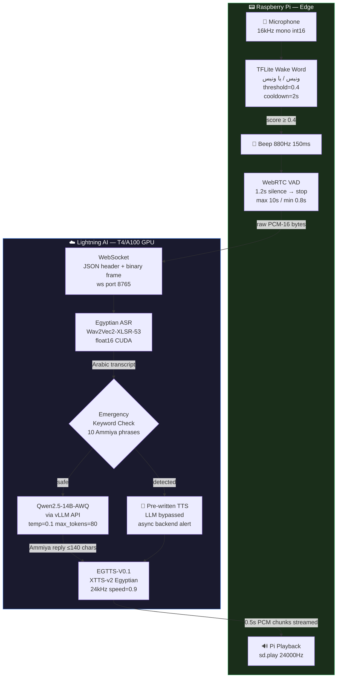

<div align="center">

# 🎙️ ونيس — Wanees
### *Empowering Elderly Care through Arabic Speech AI*

> **An open-source, privacy-first, real-time Egyptian Arabic Voice Companion — engineered for the elderly across Egypt and the Middle East, optimized for edge deployment on Raspberry Pi with cloud inference on Lightning AI.**

<br>

[](https://opensource.org/licenses/Apache-2.0)
[](https://www.python.org/)
[](https://lightning.ai/)
[](https://github.com/vllm-project/vllm)
[](https://huggingface.co/Qwen/Qwen2.5-14B-Instruct-AWQ)
[](https://huggingface.co/OmarSamir/EGTTS-V0.1)
[](https://www.raspberrypi.com/)
[](https://github.com/assermosa/Voice-Assistant-For-Elder)

<br>

</div>

---

## 📋 Table of Contents

- [The Social Imperative](#-the-social-imperative)
- [Key Features](#-key-features)
- [System Architecture](#-system-architecture)
- [Performance Benchmarks](#-performance-benchmarks)
- [Model Stack](#-model-stack)
- [Younes Persona & Prompt Design](#-younes-persona--prompt-design)
- [Emergency Detection System](#-emergency-detection-system)
- [WebSocket Protocol](#-websocket-protocol)
- [Server Setup (Lightning AI)](#-server-setup-lightning-ai)
- [Raspberry Pi Client Setup](#-raspberry-pi-client-setup)
- [Wake Word Training](#-wake-word-training)
- [Project Structure](#-project-structure)
- [Future Roadmap](#-future-roadmap)
- [Contributing](#-contributing)
- [Citation](#-citation)

---

## 🌍 The Social Imperative

The Arab world is undergoing one of the fastest demographic aging transitions in history. By 2050, the elderly population in the MENA region is projected to **triple**, yet assistive technology for Arabic-speaking elderly users remains critically underdeveloped. Existing global voice assistants (Alexa, Siri, Google Assistant) fail this population on multiple axes: they do not speak Egyptian Ammiya, they depend on cloud infrastructure that harvests sensitive data, and they are designed for the tech-literate general consumer — not for a 75-year-old in Cairo who simply wants to talk.

**Wanees (ونيس)** — meaning *companion* or *the one who brings comfort* in Egyptian Arabic — was built to close that gap.

| Challenge | Global Assistants | Wanees |
|---|---|---|
| **Arabic Dialect** | Modern Standard Arabic only | Egyptian Ammiya (Cairo/Delta) |
| **Privacy** | Cloud-dependent, data harvested | Edge VAD + Wake Word, no raw audio stored |
| **Persona** | Generic, robotic | "الابن البار" — Warm, familial Egyptian companion |
| **Emergency Response** | None | Keyword detection → instant TTS bypass + family alert |
| **Medication Reminders** | None | Backend push via WebSocket → synthesized speech |
| **Latency** | 2–8s (network-dependent) | ~4s end-to-end on T4 GPU |

---

## ✨ Key Features

- 🗣️ **Egyptian Ammiya ASR** — Wav2Vec2-XLSR-53 fine-tuned on Egyptian Arabic (`IbrahimAmin/egyptian-arabic-wav2vec2-xlsr-53`)
- 🧠 **Arabic LLM via vLLM** — `Qwen/Qwen2.5-14B-Instruct-AWQ` with PagedAttention, AWQ 4-bit quantization, max 2048 context
- 🔊 **Egyptian TTS** — `OmarSamir/EGTTS-V0.1` (XTTS-v2 fine-tuned on Egyptian speech), streaming PCM chunks at 24kHz
- 👂 **Custom Wake Word** — `ونيس` / `يا ونيس` via TFLite classifier + OpenWakeWord `AudioFeatures` embedding, scored every 320ms
- 🎯 **WebRTC VAD** — Endpointing with 1.2s silence threshold, 20ms frames; energy-based fallback if `webrtcvad` unavailable
- 🚨 **Emergency Detection** — 10 Egyptian Ammiya distress keywords bypass the LLM entirely + fire async backend alert
- 💊 **Medication Reminder Push** — Backend pushes reminders to any Pi over the same WebSocket connection
- 🔁 **Per-Device Conversation History** — 6-turn rolling context window, keyed by `user_id`
- ⚡ **Streaming TTS Delivery** — Audio sliced into 0.5s PCM chunks; Pi starts playing before synthesis completes
- 🌐 **Clean WebSocket Protocol** — JSON event frames + binary PCM audio over a single persistent connection

---

## 🏗️ System Architecture

### Two-File Design

```
server.py    ←  Lightning AI Cloud  (ASR + LLM + TTS + WebSocket server)
pi_main.py   ←  Raspberry Pi Edge   (Wake Word + VAD + Audio I/O + WebSocket client)
```

### Full Pipeline

```
┌──────────────────────────────────────────────────────────────────────┐
│                     RASPBERRY PI (Edge)                              │
│                                                                      │
│  🎤 Microphone  (16kHz, mono, int16)                                 │
│        │                                                             │
│        ▼  CHUNK_SIZE=1280 samples (80ms)                             │
│  ┌──────────────────────────────────────┐                            │
│  │  TFLite Wake Word Classifier         │  Rolling 1-second buffer   │
│  │  "ونيس" / "يا ونيس"                  │  AudioFeatures.embed_clips │
│  │  threshold = 0.4                     │  Scored every 4 chunks     │
│  │  cooldown  = 2.0s                    │  → (320ms scoring interval)│
│  └─────────────────┬────────────────────┘                            │
│                    │ score ≥ 0.4                                      │
│                    ▼                                                  │
│             🔔 Beep (880Hz, 150ms)                                   │
│                    │                                                  │
│                    ▼                                                  │
│  ┌──────────────────────────────────────┐                            │
│  │  WebRTC VAD  (aggressiveness=2)      │  20ms frames               │
│  │  Stop on 1.2s silence               │  Energy VAD fallback        │
│  │  Min 0.8s / Max 10s recording       │                             │
│  └─────────────────┬────────────────────┘                            │
│                    │ raw PCM-16 bytes                                  │
└────────────────────┼─────────────────────────────────────────────────┘
                     │
                     │  WebSocket  ws://<server>:8765
                     │  Frame 1 (text):   JSON header
                     │  Frame 2 (binary): raw PCM bytes
                     ▼
┌──────────────────────────────────────────────────────────────────────┐
│                     LIGHTNING AI SERVER (Cloud GPU)                  │
│                                                                      │
│  WebSocket Handler  (max_size=20MB, ping_interval=20s)               │
│        │                                                             │
│        ▼                                                             │
│  ┌─────────────────────────────────────────┐                         │
│  │  ASR: IbrahimAmin/                      │                         │
│  │  egyptian-arabic-wav2vec2-xlsr-53       │ → {"type":"asr"}        │
│  │  float16, CUDA, HuggingFace pipeline    │                         │
│  └────────────────────┬────────────────────┘                         │
│                       │ Arabic transcript                             │
│                       ▼                                              │
│  ┌─────────────────────────────────────────┐                         │
│  │  Emergency Keyword Check                │                         │
│  │  10 Egyptian Ammiya distress phrases    │ → {"type":"emergency"}  │
│  │  + async backend alert (non-blocking)   │   + LLM bypassed        │
│  └────────────────────┬────────────────────┘                         │
│               no emergency │                                          │
│                       ▼                                              │
│  ┌─────────────────────────────────────────┐                         │
│  │  LLM: Qwen/Qwen2.5-14B-Instruct-AWQ    │                         │
│  │  via vLLM OpenAI-compatible API         │ → {"type":"llm"}        │
│  │  temp=0.1, top_p=0.85, max_tokens=80   │                         │
│  │  6-turn history, 2 turns per request   │                         │
│  └────────────────────┬────────────────────┘                         │
│                       │ Egyptian Ammiya reply (≤140 chars)           │
│                       ▼                                              │
│  ┌─────────────────────────────────────────┐                         │
│  │  TTS: OmarSamir/EGTTS-V0.1             │                         │
│  │  XTTS-v2 fine-tuned on Egyptian Arabic  │ → binary PCM chunks     │
│  │  24kHz, speed=0.9, 0.5s chunks         │ → {"type":"tts_end"}    │
│  └────────────────────┬────────────────────┘                         │
└───────────────────────┼──────────────────────────────────────────────┘
                        │ Binary PCM-16 chunks (24kHz) streamed back
                        ▼
┌──────────────────────────────────────────────────────────────────────┐
│  RASPBERRY PI — Playback                                             │
│  np.frombuffer(buffer, dtype=np.int16)                               │
│  sd.play(audio_np, samplerate=24000)                                 │
└──────────────────────────────────────────────────────────────────────┘
```

### Mermaid Diagram



---

## ⚡ Performance Benchmarks

Wanees achieves **~4 seconds end-to-end latency** from end of utterance to first audio playback on the Pi — measured on Lightning AI T4 GPU.

### Latency Breakdown

| Stage | Component | Measured Latency |
|---|---|---|
| Wake word scoring | TFLite + AudioFeatures (Pi) | < 320ms per scoring window |
| VAD recording | WebRTC 20ms frames (Pi) | 0.8–10s (utterance-dependent) |
| Network transfer | PCM bytes over WebSocket | ~50–200ms |
| ASR inference | Wav2Vec2-XLSR-53 float16 CUDA | ~300–600ms |
| Emergency scan | 10 keyword substring check | < 1ms |
| LLM first token | Qwen2.5-14B-AWQ via vLLM | ~800–1,200ms |
| TTS synthesis | EGTTS-V0.1 full utterance | ~800–1,500ms |
| First audio chunk to Pi | 0.5s PCM stream start | ~200ms after synth begins |
| **Server-side total** | **ASR → LLM → first TTS chunk** | **~2.1–3.3s** |
| **End-to-end total** | **Utterance end → audio plays** | **~3.5–4.5s** |

### Optimization Details

**AWQ 4-bit Quantization + vLLM PagedAttention**

`Qwen2.5-14B-Instruct-AWQ` shrinks the model from ~28GB (FP16) to ~7GB, fitting on a T4 alongside ASR and TTS. vLLM's PagedAttention virtualizes KV cache memory, eliminating fragmentation. `max_tokens=80` hard-caps generation to match the 140-character persona constraint — no wasted decode cycles.

```bash
vllm serve Qwen/Qwen2.5-14B-Instruct-AWQ \
  --quantization awq \
  --dtype half \
  --max-model-len 2048 \
  --gpu-memory-utilization 0.6 \
  --port 8000
```

**Streaming TTS Chunk Delivery**

EGTTS synthesizes the full utterance on GPU, then the PCM-16 array is sliced into 0.5-second chunks (12,000 samples at 24kHz) and yielded over the WebSocket immediately. The Pi begins playback on the first chunk while subsequent chunks are still arriving:

```python
samples_per_chunk = int(TTS_SAMPLE_RATE * chunk_seconds)  # 12,000
for start in range(0, len(wav_i16), samples_per_chunk):
    yield wav_i16[start : start + samples_per_chunk].tobytes()
    await asyncio.sleep(0)   # yield to event loop between sends
```

**CUDA Graph + TF32 Optimizations**

```python
torch.backends.cudnn.benchmark = True
torch.backends.cuda.matmul.allow_tf32 = True
torch.backends.cudnn.allow_tf32 = True
torch.set_float32_matmul_precision("high")
os.environ["PYTORCH_CUDA_ALLOC_CONF"] = "max_split_size_mb:512"
```

**Edge VAD Pre-filtering**

WebRTC VAD runs entirely on the Pi. Only post-speech audio is sent to the server — silence is never transmitted, keeping payload size and server processing minimal.

**LLM Constraint Design**

`temperature=0.1` and `max_tokens=80` ensure fast, deterministic outputs. The 140-character brevity constraint in the system prompt accelerates model convergence. Rolling 6-turn history (only 2 turns injected per request) keeps the prompt short and latency bounded.

---

## 🧩 Model Stack

| Component | Model ID | Notes |
|---|---|---|
| **ASR** | `IbrahimAmin/egyptian-arabic-wav2vec2-xlsr-53` | HuggingFace pipeline, float16, CUDA |
| **LLM** | `Qwen/Qwen2.5-14B-Instruct-AWQ` | Served via vLLM, AWQ 4-bit, `gpu_memory_utilization=0.6` |
| **TTS** | `OmarSamir/EGTTS-V0.1` | XTTS-v2 fine-tuned on Egyptian Arabic, 24kHz, `speed=0.9` |
| **Wake Word** | `wanees.tflite` (custom) | TFLite classifier + OpenWakeWord `AudioFeatures` embedding |
| **VAD** | `webrtcvad` Python package | aggressiveness=2, 20ms frames; RMS energy fallback |

---

## 🧠 Wanees Persona & Prompt Design

The LLM is guided by a carefully engineered system prompt that constructs **Younes (يونس)** — a 35-year-old Egyptian man acting as *"الابن البار"* (The Dutiful Son) for elderly users. This is not a generic assistant persona; it is a culturally-grounded character with explicit language rules.

### Core Constraints in the System Prompt

**Dialect enforcement** — All responses must use Egyptian Street Arabic (Ammiya Masriya). Fusha constructs (`سوف`, `لماذا`, `كيف`, `لا تقلق`) are explicitly banned. Egyptian equivalents (`هـ`, `ليه`, `إزاي`, `متقلقش`) are required.

**Honorifics** — The model constantly uses Egyptian terms of endearment: `يا والدنا`, `يا ست الكل`, `يا غالي`, `يا فندم`, `يا حبيبي`.

**Brevity constraint** — Responses are capped at 140 characters, optimized for TTS synthesis speed and elderly listening attention spans. This also makes `max_tokens=80` a safe hard ceiling.

**Spirituality** — Egyptian blessings are woven in naturally: `ربنا يبارك في عمرك`, `ربنا يشفيك ويعافيك`, `الدوام لله`.

**Medical framing** — Home-style comfort advice (e.g. `اشربي كوباية كركديه بارد`) is always followed by a gentle referral to a doctor.

### LLM Call Parameters

```python
await openai_client.chat.completions.create(
    model="Qwen/Qwen2.5-14B-Instruct-AWQ",
    messages=messages,
    temperature=0.1,
    top_p=0.85,
    max_tokens=80,
    frequency_penalty=0.3,
    presence_penalty=0.2,
    stop=["User:", "user:", "المستخدم:", "###", "\n\n\n"],
)
```

### Few-Shot Examples (from the live system prompt)

```
User:  "أنا وحيد وزعلان يا يونس، ومفتقد الأيام الحلوة."
Wanees: "يا غالي إحنا معاك وجنبك، والبركة كلها في وجودك معانا.
         الدنيا لسه بخير طول ما إنت فيها، تحب أحكي لك حكاية
         من بتاعة زمان تحسن بالك؟"

User:  "ضغطي عالي وراسي مصدعة أوي."
Wanees: "سلامتك من الآه يا ست الكل، ارتاحي بس شوية في الضلمة
         واشربي كوباية كركديه بارد، ولو فضلتي تعبانة لازم نكلم
         الدكتور يطمنا، صحتك عندنا بالدنيا."

User:  "مراتي ماتت وبقيت لوحدي في البيت."
Wanees: "الدوام لله يا غالي، ربنا يرحمها ويصبر قلبك، كانت ست
         أصيلة. أنا معاك أهو ومش هسيبك أبدًا."
```

---

## 🚨 Emergency Detection System

Every ASR transcript is scanned for 10 Egyptian Ammiya distress keywords **before the LLM is called**:

```python
EMERGENCY_KEYWORDS = [
    "بموت", "بتوفى", "مش قادر أتنفس", "مش قادرة أتنفس",
    "الحقني", "النجدة", "اطلب إسعاف", "ألم في صدري",
    "وقعت", "سقطت", "ما بنفسش",
]
```

When a keyword is detected the pipeline:

1. **Bypasses the LLM entirely** — zero generation latency
2. **Immediately synthesizes this pre-written calming response:**
   > *"متقلقش يا غالي، أنا كلمت أهلك دلوقتي وهما زمانهم جايين في الطريق. خليك هادي وأنا جنبك مش هسيبك."*
3. **Fires `send_emergency_signal_to_backend(user_id, transcript)` as an `asyncio.create_task`** — fully non-blocking, audio plays without any delay
4. **Sends `{"type": "emergency", "text": "..."}` JSON event** to the Pi for logging or LED/display indicators

The backend alert function is a clearly marked placeholder ready for HTTP POST, MQTT, SMS gateway, or any notification service:

```python
async def send_emergency_signal_to_backend(user_id: str, transcript: str) -> None:
    log.warning("🚨 EMERGENCY detected for user=%s", user_id)
    # async with aiohttp.ClientSession() as session:
    #     await session.post("https://your-backend.com/api/emergency", ...)
```

---

## 🔌 WebSocket Protocol

The server binds on `0.0.0.0:8765` (override via `WS_HOST` / `WS_PORT`). One handler serves both Pi clients and backend medication pushes.

### Pi → Server: audio utterance

```
Frame 1 (text JSON):
  {"type": "audio", "user_id": "pi-living-room-001", "encoding": "pcm16_16k_mono"}

Frame 2 (binary):
  <raw PCM-16 bytes — 16kHz mono int16>
```

### Backend → Server: medication reminder push

```
Frame 1 (text JSON):
  {"type": "medication_reminder", "user_id": "pi-living-room-001", "text": "حان وقت دواء الضغط يا غالي"}
```

### Server → Pi: response stream

```
{"type": "asr",                "text": "..."}          ← transcript ready
{"type": "llm",                "text": "..."}          ← Younes text reply
{"type": "emergency",          "text": "..."}          ← emergency reply text
<binary frame>                                         ← PCM-16 24kHz TTS chunk (0.5s)
<binary frame>                                         ← next 0.5s chunk ...
{"type": "tts_end"}                                    ← signal Pi to start playback
{"type": "medication_reminder","text": "..."}          ← reminder text echo
{"type": "error",              "message": "..."}       ← error description
```

---

## ⚙️ Server Setup (Lightning AI)

### Prerequisites

- Lightning AI Studio with **T4 or A100 GPU** (T4 minimum for ASR + LLM + TTS simultaneously)
- Python 3.10+, CUDA 12.1

### 1. Clone & Install

```bash
git clone https://github.com/assermosa/Voice-Assistant-For-Elder.git
cd Voice-Assistant-For-Elder

pip install torch torchaudio --index-url https://download.pytorch.org/whl/cu121
pip install transformers accelerate huggingface_hub
pip install TTS                   # Coqui TTS — provides XTTS-v2 / EGTTS
pip install vllm
pip install websockets lightning openai numpy
```

### 2. Start vLLM Server (separate terminal)

```bash
vllm serve Qwen/Qwen2.5-14B-Instruct-AWQ \
  --quantization awq \
  --dtype half \
  --max-model-len 2048 \
  --gpu-memory-utilization 0.6 \
  --port 8000
```

Wait for `INFO: Application startup complete` before proceeding.

### 3. Start Wanees Server

```bash
# Recommended for development — no Lightning orchestrator needed
python server.py --standalone

# Production — via Lightning AI orchestrator
python server.py
```

### 4. Environment Variables

| Variable | Default | Description |
|---|---|---|
| `VLLM_API_BASE` | `http://localhost:8000/v1` | vLLM server endpoint |
| `VLLM_MODEL_NAME` | `Qwen/Qwen2.5-14B-Instruct-AWQ` | Model identifier sent to vLLM API |
| `WS_HOST` | `0.0.0.0` | WebSocket bind address |
| `WS_PORT` | `8765` | WebSocket port |
| `HF_HOME` | `~/hf` | HuggingFace cache root |

### Lightning AI Studio Config

```yaml
# .lightning/studio.yml
name: wanees-voice-assistant
compute:
  type: gpu
  gpu_type: T4        # minimum: T4 16GB | recommended: A100 40GB
  num_gpus: 1
environment:
  python: "3.10"
  cuda: "12.1"
```

### Model Download (first run)

On first startup, `ModelManager` auto-downloads via HuggingFace Hub:

- **ASR**: `IbrahimAmin/egyptian-arabic-wav2vec2-xlsr-53` — ~1.2GB
- **TTS**: `OmarSamir/EGTTS-V0.1` — downloaded via `snapshot_download`, includes `config.json`, `*.pth`, `*.wav` reference audio
- **LLM**: Pre-loaded by the vLLM server process (`Qwen/Qwen2.5-14B-Instruct-AWQ` — ~7GB)

---

## 📟 Raspberry Pi Client Setup

### Hardware

- Raspberry Pi 4 or 5 (4GB+ RAM recommended)
- USB microphone or I2S HAT (e.g. ReSpeaker 2-Mic)
- Speaker (3.5mm or USB)

### 1. Install Dependencies

```bash
pip install sounddevice numpy websockets tensorflow openwakeword
pip install webrtcvad   # strongly recommended for accurate VAD
```

### 2. Copy Wake Word Model to Pi

```bash
# From development machine:
scp wakeword_models/ya_Wanees.tflite pi@<PI_IP>:/home/pi/younes/wanees.tflite
```

### 3. Configure `pi_main.py`

Edit the config block at the top of the file:

```python
SERVER_URI      = "ws://<YOUR_LIGHTNING_SERVER_IP>:8765"
USER_ID         = "pi-living-room-001"           # unique per physical device
WAKEWORD_MODEL  = "/home/pi/younes/wanees.tflite"
WAKEWORD_THRESH = 0.4
```

### 4. Run

```bash
python pi_main.py
```

Expected output:
```
==================================================
  Wanees AI — Raspberry Pi Client
==================================================
  VAD      : WebRTC ✅
  Model    : /home/pi/younes/wanees.tflite
  Server   : ws://x.x.x.x:8765
  Threshold: 0.4
  User ID  : pi-living-room-001

✅ All checks passed — starting...

👂 Listening for "ونيس" or "يا ونيس"...
```

### VAD & Wake Word Tuning Reference

| Parameter | Default | Notes |
|---|---|---|
| `VAD_AGGRESSIVENESS` | `2` | 0 = permissive, 3 = aggressive |
| `VAD_SILENCE_SEC` | `1.2` | Seconds of silence before recording stops |
| `VAD_MAX_SEC` | `10.0` | Maximum recording duration |
| `VAD_MIN_SEC` | `0.8` | Recordings shorter than this are discarded |
| `WAKEWORD_THRESH` | `0.4` | Lower = more sensitive, more false positives |
| `COOLDOWN_SEC` | `2.0` | Minimum gap between consecutive detections |
| `SCORE_EVERY` | `4` chunks | Scoring interval = 320ms (CPU efficiency) |

---

## 🗣️ Wake Word Training

The wake word `ونيس` / `يا ونيس` is a custom TFLite binary classifier trained on top of OpenWakeWord's pre-trained audio embedding backbone (`AudioFeatures`).

### Quick Synthetic Training (no recordings required)

```python
from openwakeword.train import train_model

train_model(
    model_name="ya_Wanees",
    positive_references=[
        "ya wanees",   # English phonetic
        "wanees",
        "يا ونيس",     # Arabic spelling
        "ونيس",
    ],
    n_samples=5000,
    output_dir="./wakeword_models",
)
```

### Fine-tuning with Real Voice Samples (recommended for production)

```python
import sounddevice as sd, numpy as np

def record_sample(filename, duration=2):
    audio = sd.rec(int(duration * 16000), samplerate=16000,
                   channels=1, dtype='int16')
    sd.wait()
    audio.tofile(filename)

# 20 positive samples — say "يا ونيس"
for i in range(20):
    input(f"Press Enter then say 'يا ونيس' ({i+1}/20)")
    record_sample(f"my_samples/positive/sample_{i+1}.raw")

# 20 negative samples — random speech, not the wake word
for i in range(20):
    input(f"Press Enter then say anything except 'ونيس' ({i+1}/20)")
    record_sample(f"my_samples/negative/sample_{i+1}.raw")

train_model(
    model_name="ya_Wanees",
    positive_references=["ya wanees", "wanees", "يا ونيس", "ونيس"],
    positive_wav_files="./my_samples/positive",
    negative_wav_files="./my_samples/negative",
    n_samples=5000,
    output_dir="./wakeword_models",
)
```

### Wake Word Inference Architecture (Pi)

```
16kHz audio → 1-second rolling buffer (16,000 int16 samples)
    → AudioFeatures.embed_clips()        # openWakeWord backbone
    → mean-pool  → shape (1, 96) float32
    → TFLite classifier.invoke()
    → score: float 0.0 – 1.0
    → if score ≥ 0.4: trigger VAD → record → send to server
```

---

## 📁 Project Structure

```
Voice-Assistant-For-Elder/
│
├── server.py                  ← Lightning AI cloud server
│   ├── ModelManager           ·  Loads ASR + vLLM client + EGTTS at startup
│   ├── YounesPipeline         ·  ASR → Emergency check → LLM → TTS async generator
│   ├── ws_handler             ·  WebSocket protocol: audio + medication push
│   ├── YounesServer           ·  LightningWork component (parallel=True)
│   └── YounesApp              ·  LightningApp entry point
│
├── pi_main.py                 ← Raspberry Pi edge client
│   ├── load_models()          ·  TFLite interpreter + OpenWakeWord AudioFeatures
│   ├── get_wakeword_score()   ·  Embedding extraction + TFLite inference
│   ├── record_with_vad()      ·  WebRTC VAD recording loop (energy fallback)
│   ├── send_to_server()       ·  WebSocket client: JSON header + binary audio
│   └── main()                 ·  Rolling buffer + wake word detection loop
│
├── wakeword_training.py       ← Wake word training + sample collection scripts
│
├── wakeword_models/           ← Trained TFLite wake word models
│   └── ya_Wanees.tflite
│
└── my_samples/                ← Voice samples for fine-tuning
    ├── positive/              ·  "يا ونيس" recordings (.raw PCM)
    └── negative/              ·  Non-wake-word speech (.raw PCM)
```

---

## 🗺️ Future Roadmap

```
v1.0 — Current Release
  ✅ Egyptian Ammiya ASR  (Wav2Vec2-XLSR-53)
  ✅ Qwen2.5-14B-AWQ via vLLM with Younes persona
  ✅ EGTTS-V0.1 streaming TTS at 24kHz, 0.5s chunks
  ✅ Custom TFLite wake word "ونيس"
  ✅ WebRTC VAD endpointing on Pi
  ✅ Emergency keyword detection with LLM bypass
  ✅ Medication reminder push via WebSocket
  ✅ 6-turn conversation history per device
  ✅ ~4s end-to-end latency on T4 GPU

v1.5 — Multi-Dialect Support
  🔲 Levantine Arabic ASR (Syrian, Lebanese, Palestinian)
  🔲 Gulf Arabic ASR (Saudi, UAE)
  🔲 Automatic dialect identification + ASR routing
  🔲 Dialect-matched TTS voices

v2.0 — Health Intelligence Layer
  🔲 Scheduled medication reminders via cron + backend API
  🔲 Real emergency backend integration (SMS, WhatsApp, HTTP POST)
  🔲 Passive speech biomarker monitoring (cognitive decline indicators)
  🔲 Fall detection via ambient audio classification
  🔲 Emergency contact management interface

v2.5 — Full Edge / Offline Mode
  🔲 llama.cpp GGUF backend for fully offline Pi inference
  🔲 On-device Whisper.cpp ASR (no network ASR)
  🔲 TensorRT-optimized TTS for Jetson Nano
  🔲 MQTT multi-device coordination

v3.0 — Research Platform
  🔲 Annotated Egyptian elderly speech corpus (open release)
  🔲 Federated learning for privacy-preserving dialect improvement
  🔲 Benchmark suite for Arabic geriatric voice AI evaluation
```

---

## 🤝 Contributing

Contributions from engineers, Arabic NLP researchers, and clinical practitioners are warmly welcomed.

```bash
git checkout -b feature/your-feature-name
# make changes
git push origin feature/your-feature-name
# → open Pull Request
```

**Priority areas:**

| Area | Skills Needed | Priority |
|---|---|---|
| Real emergency backend (SMS/HTTP) | Backend, webhooks | 🔴 Critical |
| Egyptian dialect speech corpus expansion | Annotation, Arabic linguistics | 🔴 Critical |
| Fully offline Pi deployment (llama.cpp) | C++, embedded, GGUF | 🟠 High |
| WebRTC VAD tuning for elderly speech patterns | DSP, audio ML | 🟠 High |
| Multi-dialect ASR routing | NLP, Arabic dialectology | 🟡 Medium |
| Caregiver dashboard UI | React Native / Flutter | 🟡 Medium |

---

## 📄 Citation

```bibtex
@software{wanees2025,
  author       = {Asser Mosa},
  title        = {Wanees (ونيس): Open-Source Egyptian Arabic Voice Assistant for Elderly Care},
  year         = {2025},
  publisher    = {GitHub},
  howpublished = {\url{https://github.com/assermosa/Voice-Assistant-For-Elder}},
  note         = {Stack: Wav2Vec2-XLSR-53 ASR + Qwen2.5-14B-AWQ via vLLM +
                  EGTTS-V0.1 TTS + TFLite Wake Word.
                  Lightning AI cloud inference + Raspberry Pi edge deployment.}
}
```

---

<div align="center">

**Built with care for the people who built our world.**

*"ربنا يبارك في عمرك"*

⭐ Star this repository if Wanees inspires your work ⭐

[🐛 Report Bug](https://github.com/assermosa/Voice-Assistant-For-Elder/issues) · [💡 Request Feature](https://github.com/assermosa/Voice-Assistant-For-Elder/issues)

</div>
